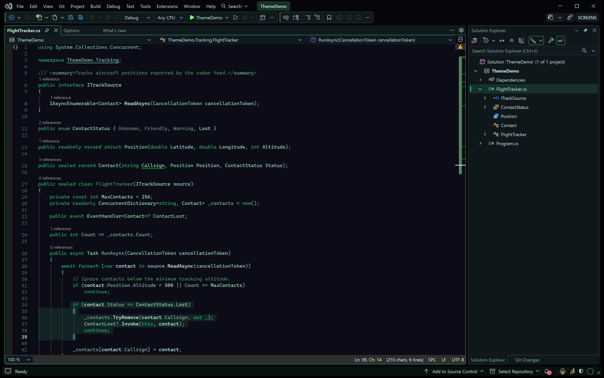

# Radar Theme for Visual Studio 2026

A dark Visual Studio 2026 theme inspired by radar and avionics displays. It combines a near-black navy background with restrained phosphor greens, cyan-tinted text and high-contrast semantic highlighting.

## Screenshots



*C# editor with semantic highlighting and the v1.0.5 selection color.*

## Design

Radar takes its cues from radar scopes and avionics displays: a dark, low-glare surface with information drawn in calm phosphor greens and pale cyan.

- **Radar / avionics display** – a restrained instrument-panel look rather than a neon "hacker" palette.
- **Near-black navy background** – easy on the eyes during long sessions.
- **Green accent** – radar green is used for keywords, focus and active UI elements.
- **Cyan/white primary code text** – ordinary code stays bright and readable.
- **Semantic C# highlighting** – classes, interfaces, structs, enums, methods, properties, fields, parameters and locals get distinct but related tones.
- **Strong but non-distracting selection** – selected text is clearly visible without overpowering the code.

Errors and warnings keep distinct red/amber accents.

### Main colors

| Role | Color |
| --- | --- |
| Editor background | `#0B0C17` |
| Radar green | `#29A66C` |
| Phosphor green | `#66B995` |
| Primary text | `#C6EDE2` |
| Comments | `#4C895C` |

### Selection (v1.0.5)

| Role | Color |
| --- | --- |
| Active selection | `#2A7255` |
| Inactive selection | `#1A4636` |

## Requirements

- Visual Studio 2026
- 64-bit Visual Studio (x64 or ARM64)

## Installation

1. Download the latest `.vsix` from [GitHub Releases](../../releases).
2. Close Visual Studio.
3. Run the VSIX installer (double-click the `.vsix` file).
4. Start Visual Studio.
5. Open **Tools → Options → Environment → Visual Experience**.
6. Under **Color theme**, select **Radar**.

If Radar v1.0.4 is already installed, installing v1.0.5 updates the existing extension; it does not add a second theme.

## Building from source

Requirements:

- Visual Studio 2026 with the **Visual Studio extension development** workload (VSSDK)

Run:

```text
build-release.cmd
```

The script locates MSBuild via `vswhere`, restores NuGet packages, rebuilds the project in Release mode, verifies that the Radar theme registration is present in the generated VSIX (`verify-vsix.ps1`) and exports:

```text
RadarTheme-VS2026-v1.0.5.vsix
```

## Fonts

The theme does not install or change any font. It works well with modern monospaced coding fonts.

## Version history

**v1.0.5**
- Improved selected-text visibility, especially on lower-contrast displays.

**v1.0.4**
- Stable Radar theme baseline.

## License

Released under the [MIT License](LICENSE).
